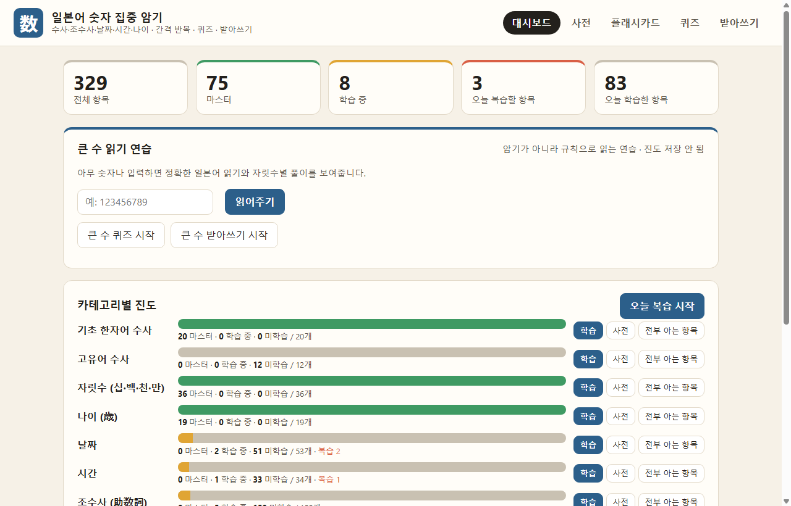
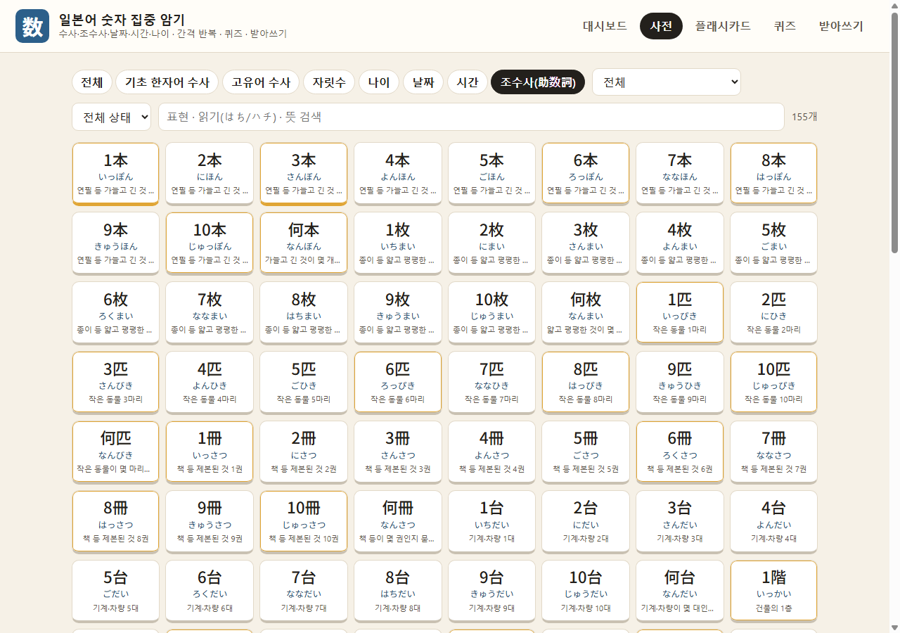
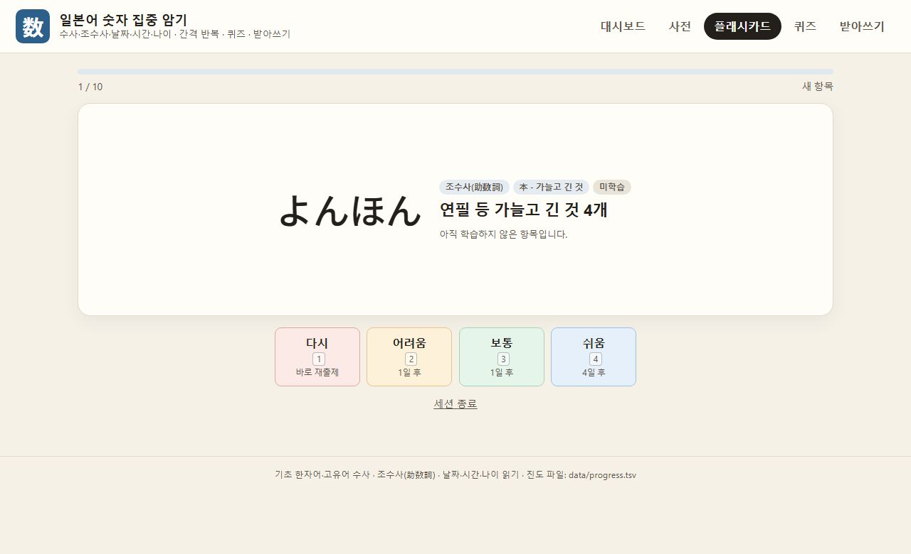
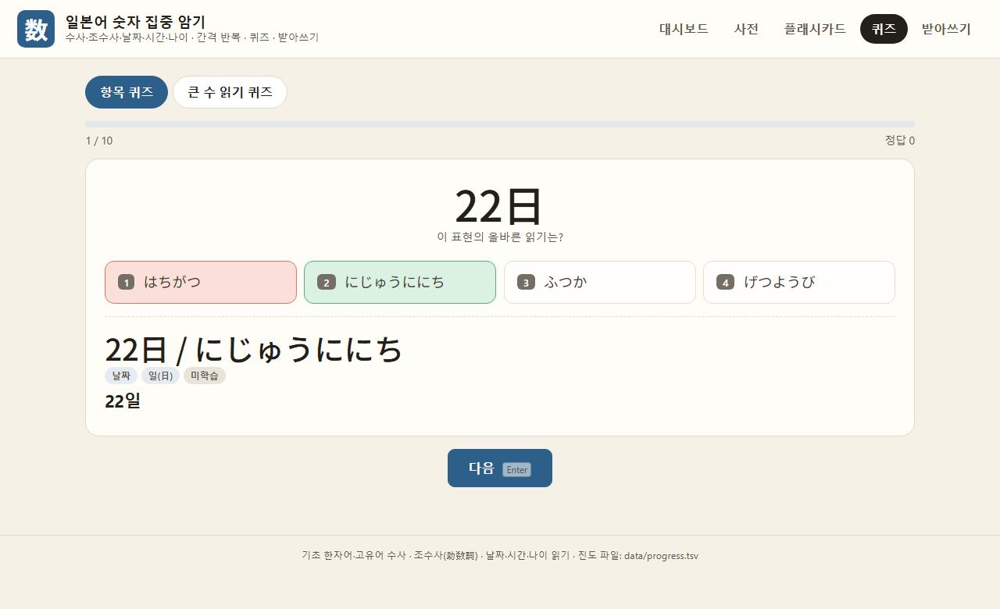
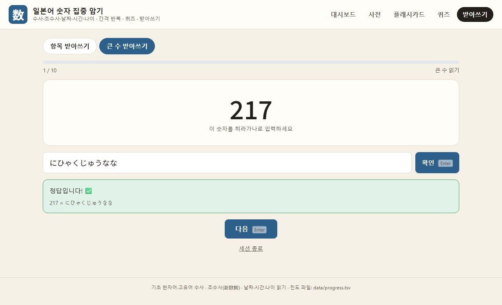

# 일본어 숫자 집중 암기 (Nihongo Suuji Trainer)

일본어 **숫자**만 집중적으로 공부하는 웹앱입니다. 순수 Java(JDK 17+)로 작성했고 외부 라이브러리가 전혀 없습니다.
서버는 JDK 내장 `com.sun.net.httpserver.HttpServer`, 화면은 바닐라 HTML/CSS/JS입니다. 같은 시리즈의
[常用漢字 집중 학습](https://github.com/sujeong2692/joyo-kanji-trainer) 앱과 동일한 구조로 만들었습니다.

## 다루는 범위

기초 한자어 수사(一二三…)와 고유어 수사(ひとつふたつ…)뿐 아니라, 일본어 숫자에서 가장 까다로운
**불규칙 발음(音便)** 을 정면으로 다룹니다.

| 카테고리 | 내용 |
|---|---|
| 기초 한자어 수사 | 0~10, 100, 1000, 1만, 1억, 1조 및 4/7/9의 대체 읽기 |
| 고유어 수사 | ひとつ~とお, いくつ, はたち(20세) |
| 자릿수 | 十·百·千·万의 1~9 곱셈표 (さんびゃく, ろっぴゃく, さんぜん 등 음편 포함) |
| 조수사(助数詞) | 本·枚·匹·冊·台·階·杯·回·人·羽·頭·個·足·軒 등 14종 × 1~10 + 何〜 (촉음화·반탁음화·탁음화 전부 포함) |
| 날짜 | 一日~三十一日(1~10, 14, 20, 24일의 불규칙 훈독 포함), 월(4·7·9월 불규칙), 요일 |
| 시간 | 시(4·7·9시 불규칙), 분(촉음+반탁음 변화), 초 |
| 나이 | 歳/才 1~10세, 10·20·30…100세, 何歳 |

또한 **규칙 기반 큰 수 읽기 엔진**을 자체 구현해서, 임의의 숫자(최대 9999억9999만9999)를 입력하면
정확한 자릿수별 읽기와 풀이를 즉시 보여줍니다. 이 엔진으로 무한히 새로운 문제를 만드는 "큰 수 읽기 퀴즈·받아쓰기"도 있습니다.

## 스크린샷

| 대시보드 | 사전 (조수사) |
|---|---|
|  |  |

| 플래시카드 | 퀴즈 | 받아쓰기 |
|---|---|---|
|  |  |  |

## 기능

- **대시보드**: 카테고리별 진도 + 임의의 숫자를 바로 읽어주는 큰 수 읽기 도구
- **사전**: 카테고리·세부(助数詞별 등)·상태로 필터링, 표현·읽기·뜻 검색
- **플래시카드**: SM-2 간격 반복. 표현↔읽기 방향 선택 가능
- **퀴즈**: 저장된 항목 4지선다 + 임의 생성되는 **큰 수 읽기 퀴즈**(자릿수 난이도 선택)
- **받아쓰기**: 표현을 보고 히라가나로 직접 타이핑, 정답과 정확히 비교. 큰 수 받아쓰기는 자릿수별 풀이까지 표시

키보드: `Space`/`Enter` 정답 보기·확인, `1`~`4` 채점/선택.

## 독립 실행형 HTML (서버 불필요)

JDK나 서버 없이 **더블클릭만으로 바로 여는** 단일 HTML 파일도 있습니다: [standalone/nihongo-suuji-trainer.html](standalone/nihongo-suuji-trainer.html).
329개 항목 데이터, 큰 수 읽기 엔진, API 로직을 모두 브라우저 안에 넣었고, 진도는 그 브라우저의 localStorage에 저장됩니다(다른 브라우저·PC에는 공유되지 않음).
데이터나 화면을 고친 뒤에는 `python3 standalone/build.py` 로 다시 생성하면 됩니다.

## 실행 (서버 버전)

JDK 17 이상이 필요합니다 (예: `winget install Microsoft.OpenJDK.21`).

```powershell
.\run.ps1            # 컴파일 후 http://localhost:8080 실행 (브라우저 자동 열림)
.\run.ps1 -Port 9000 # 다른 포트
.\run.ps1 -Jar       # 실행 가능한 suuji-trainer.jar 생성 → java -jar suuji-trainer.jar
```

macOS / Linux:

```bash
./run.sh            # 또는 ./run.sh 9000, ./run.sh --jar
```

Maven이 있다면 `mvn package` 로 `target/suuji-trainer.jar` 를 만들 수 있습니다.

서버 옵션: `java -jar suuji-trainer.jar --port 8080 --data ./data --no-browser`

## 데이터

* `src/main/resources/items.tsv` — 329개 항목. 필드: `id  category  subcategory  표현  읽기  한국어 뜻  비고(불규칙 설명)`
  * 常用漢字表 프로젝트와 마찬가지로, 불규칙/음편 읽기는 각 계열별로 사전 검증했습니다.
  * `羽`(새를 세는 단위) 등 자료마다 표기가 갈리는 항목은 note 필드에 그 사실을 명시해 두었습니다.
* `src/main/java/suuji/NumberReader.java` — 큰 수 읽기 알고리즘. `items.tsv`의 자릿수(place) 표와
  독립적으로 검증했고 완전히 일치합니다.
* `data/progress.tsv` — 학습 진도(자동 생성). 삭제하면 처음부터 시작합니다. 큰 수 읽기 연습은 무한한 문제
  집합이라 진도를 저장하지 않습니다.

## API (프론트엔드가 사용)

| 메서드 | 경로 | 설명 |
|---|---|---|
| GET | `/api/categories` | 카테고리·세부 카테고리 트리 + 진도 |
| GET | `/api/items?category=&subcategory=&status=&q=` | 항목 목록/검색 |
| GET | `/api/items/{id}` | 항목 상세 |
| GET | `/api/stats` | 진도 통계 |
| GET | `/api/review/next?category=&subcategory=&limit=&new=` | 복습 카드 뽑기 |
| POST | `/api/review` `id=&q=0..5` | 카드 채점(SM-2) |
| GET | `/api/quiz?category=&subcategory=&mode=reading|prompt&n=&pool=` | 항목 퀴즈 생성 |
| POST | `/api/quiz/answer` `id=&correct=` | 항목 퀴즈 답 기록 |
| POST | `/api/dictation/check` `id=&reading=` | 항목 받아쓰기 채점 |
| GET | `/api/bignum/read?number=` | 임의 숫자의 정확한 읽기 + 자릿수별 풀이 |
| GET | `/api/bignum/quiz?level=2|3|4|man|oku&n=` | 큰 수 읽기 퀴즈 생성 |
| POST | `/api/bignum/check` `number=&reading=` | 큰 수 받아쓰기 채점 |
| POST | `/api/progress/mark` `id= 또는 category=&subcategory=`, `status=mastered|reset` | 일괄 표시/초기화 |

## 구조

```
src/main/java/suuji/
  Main.java            서버 기동, 옵션 파싱
  Api.java             JSON API
  StaticHandler.java   정적 파일 서빙
  ItemRepository.java  items.tsv 로딩·검색
  NumberReader.java    큰 수 읽기 알고리즘 (음편 규칙 포함)
  Progress.java        SM-2 간격 반복 상태
  ProgressStore.java   progress.tsv 저장/로딩
  Item.java, Json.java
src/main/resources/
  items.tsv            숫자·조수사·날짜·시간·나이 데이터
  web/                 index.html, app.js, style.css
```
